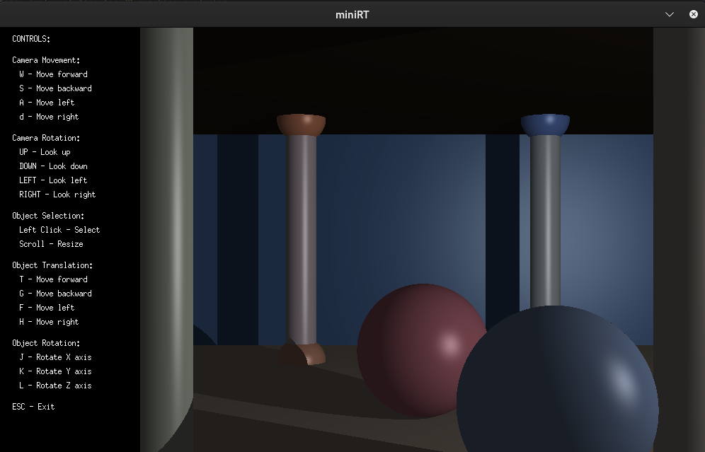
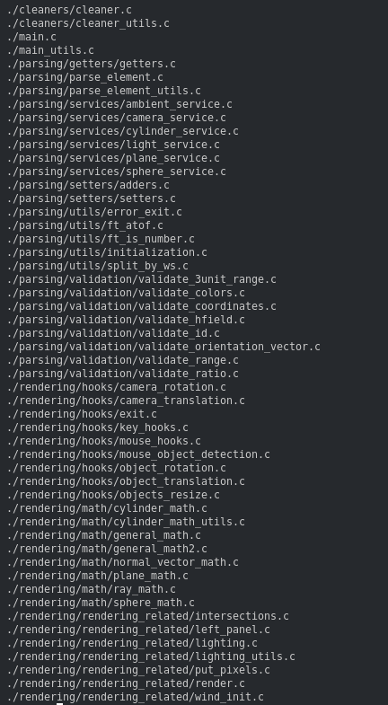

# Mini-Ray-Tracer

A ray tracer written in C that renders 3D scenes with spheres, planes, and cylinders, with real-time camera navigation and interactive object manipulation.

## Features

- Renders spheres, planes, and cylinders with accurate light and shadow calculations
- Ambient, diffuse, and specular lighting with shadow casting
- Real-time scene navigation using keyboard and mouse controls
- Click any object in the scene to select and transform it
- Reads scene definitions from `.rt` files
- Built with OpenMP for parallel rendering

## Getting Started

```sh
# Clone the repo (minilibx is fetched automatically on first build)
git clone <repo-url> mini-ray-tracer
cd mini-ray-tracer

make

./miniRT scenes/your_scene.rt
```

Controls: `WASD` to move the camera, arrow keys to rotate, `T/G` to resize the selected object, `Esc` to quit.

## Project Structure

```
mini-ray-tracer/
├── include/          # Header files for rendering and parsing
├── src/
│   ├── main.c
│   ├── rendering/    # Ray math, lighting, hooks, and pixel output
│   ├── parsing/      # Scene file reading and validation
│   └── cleaners/     # Memory cleanup
└── LIBFT/            # Bundled C utility library
```

## Demo


*A rendered scene with ambient and diffuse lighting.*


*Project file layout.*
